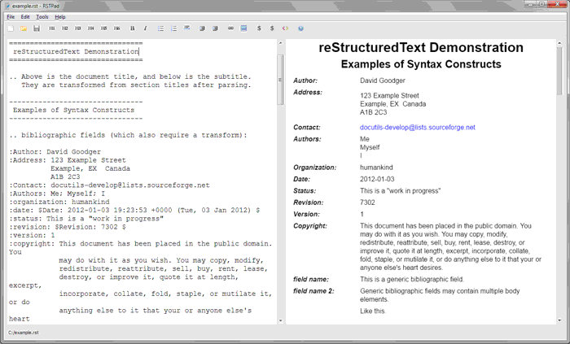

RSTPad
######

reStructuredText editor with live preview.

.. contents::

Features
********

- live preview with autoscroll

- configurable orientation (horizontal / vertical)

- search & replace

- toolbar with common elements:

  - headings
  - bold, italic
  - inline code
  - code blocks
  - horizontal rule
  - lists
  - link
  - image

- inserting highlighted code blocks (Pygments)

  - autocomplete for known lexer names

- built-in help pages

  - syntax cheat sheet
  - directives

- export to PDF

Known limitations
*****************

- UTF-8 documents only

Implementation details
**********************

- the application contains an embedded Python interpreter

  - Python libraries are located in the application's directory / bundle

- the Docutils library is used to convert RST to HTML on the fly

  - the converstion is done in a separate thread
  - *resources/preview/docutils_extensions.py* overrides some of the HTML writer's methods to insert additional tags and attributes

- HTML output is displayed using Qt WebEngine

  - external links are delegated to QDesktopServices
  - autoscroll is implemented in JavaScript
  - the preview is "frozen" during loading and autoscrolling to allow for smooth transitions (a previously rendered frame is used for the duration)

Compilation
***********

Prerequisites
=============

- QT 5.8 & Qt Creator
- Python 2.7 (32bit or 64bit depending on the used compiler)
- `Pygments <https://pypi.python.org/pypi/Pygments>`_ (tested with 2.1.3)
- `Docutils <https://sourceforge.net/p/docutils/code/HEAD/tree/trunk/docutils/>`_ (tested with 0.13, revision 7975)

Build configuration
===================

.. NOTE::
  - The paths used below (such as *C:/python*) are just examples. Use actual paths :)
  - Use forward slashes in all paths. Omit trailing slashes.
  - OS X notes and examples assume that Python 2.7 has been installed using Homebrew. Your paths may vary.

Copy *rstpad.local.pro.dist*, name it *rstpad.local.pro* and set the following variables:

- ``PYTHON_LINK``

  - Python linker flags
  - Windows: ``-LC:/python/libs -lpython27``
  - OS X: use the `python-config <http://manpages.ubuntu.com/manpages/precise/man1/python-config.1.html>`_ utility to determine linker flags:

    - ``python2.7-config --ldflags``

- ``PYTHON_INCLUDE_PATH``

  - path to a directory containing Python's header files

    - Windows: ``C:/python/include``
    - OS X: ``/usr/include/python2.7``

- ``PYTHON_SYS_PATH``

  - path to a directory containing:

    - ``libs.zip`` - the Python standard library as a ZIP archive
    - ``pygments``, ``docutils`` - library directories (these cannot be inside *libs.zip*)
    - any *.pyd*, *.dll* and *.so* modules that should be available in a standard Python installation

  - *.pyc* files should be excluded

Windows deployment
==================

#. Use the `Windows Deployment Tool <http://doc.qt.io/qt-5/windows-deployment.html#the-windows-deployment-tool>`_ with the release binary to fetch required DLLs.

   Example: ``windeployqt.exe --release --no-translations rstpad.exe``

#. Locate and copy the correct ``python27.dll`` file or the application won't work on machines without Python 2.7 installed.

   - possible locations depend on how you've installed Python and on its version:

     - *C:\\Windows\\System\\python27.dll*
     - *C:\\Windows\\SysWoW64\\python27.dll*

   - make sure you're ussing the correct version (32 vs 64bit)

OS X deployment
===============

Use the `Mac Deployment Tool <http://doc.qt.io/qt-5/osx-deployment.html#the-mac-deployment-tool>`_ to convert the resulting application into a *.dmg* file:

::

  macdeployqt RSTPad.app -dmg

Other platforms
===============

Not tested yet. You're on your own :)
